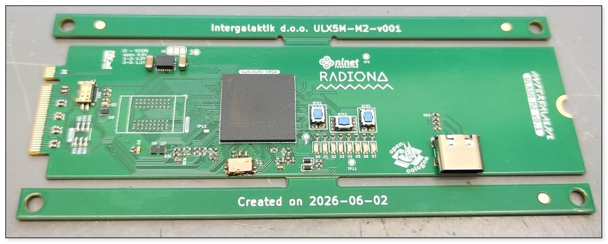
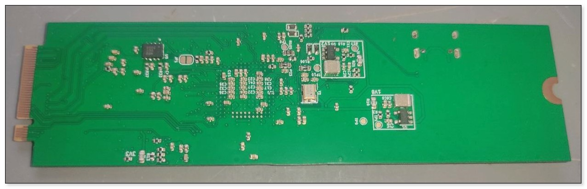

# PCB Description

This is work area for the PCB-related thoughts and explanations, including the steps and results for conducting high-speed [openEMS](https://docs.openems.de) simulations.

### M2 card

  
  

For additional detail, check the source repo:
 - [x] https://github.com/intergalaktik/ulx5m-m2

  
### Edge card
Just for illustration, and to get the ball rolling, here is an earlier attemp at PCIE "Slot" EndPoint card. Stay tuned for more...

  

#### References:
- [USB3 PHY for GateMate](https://nlnet.nl/project/GateMate-USB3-PHY)
- [KiCad and openEMS](https://www.youtube.com/watch?v=VcJqhsbzR3c)
- [Automated PCB trace selection for SI simulation](https://antmicro.com/blog/2024/07/automated-pcb-trace-selection-for-si-simulation)

--------------------
#### End of Document
