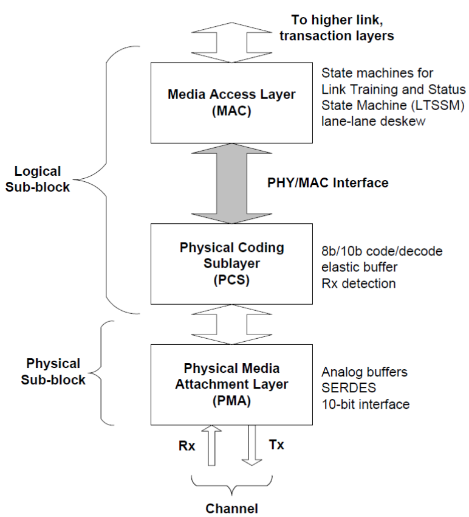
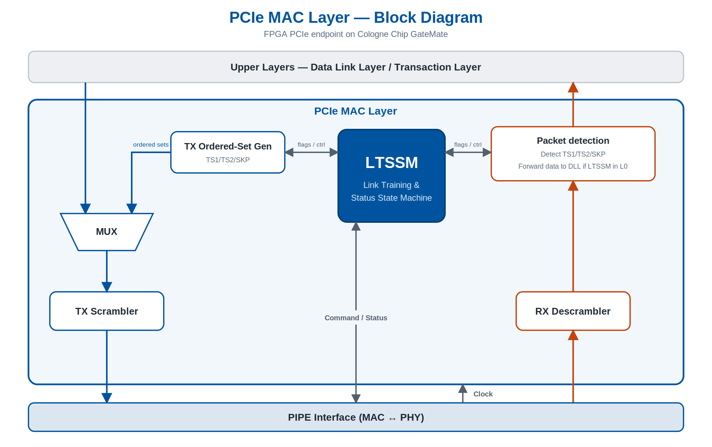
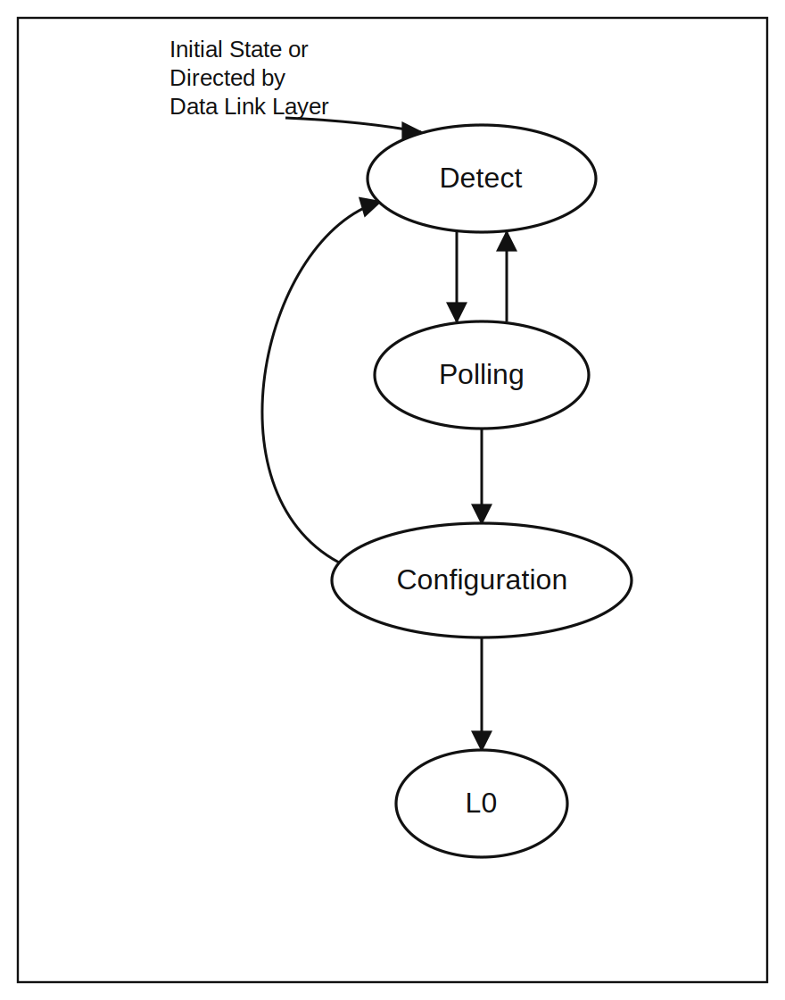

# PCIe MAC Layer

## Description
The **Media Access Control (MAC)** is the logical sub-block of the PCIe **Physical Layer**. It sits between the **Data Link Layer (DLL)** above and the **PIPE interface / SerDes PHY** below. On transmit it turns the byte stream handed down by the DLL into a scrambled symbol stream for the PHY; on receive it does the reverse. In addition, the MAC owns link bring-up and maintenance through the **Link Training and Status State Machine (LTSSM)**.

In this design the MAC is implemented as soft-core RTL in the FPGA fabric. The PHY-specific work — **8b/10b** encode/decode, the **elastic buffer**, and **word alignment** — is performed by the GateMate SerDes and reached through the PIPE interface. See the PIPE interface documentation for the details of that boundary.

## Architecture
The MAC is split into a transmit datapath, a receive datapath, and the control plane that binds them together.

- **TX datapath**: receive framed packets from DLL → scrambling → `TxData`/`TxDataK` to the PIPE interface.
- **RX datapath**: `RxData`/`RxDataK` from the PIPE interface → descrambling → packet detection → packet stream to the DLL.
- **LTSSM**: drives the PIPE command signals (`i_PowerDown`, `i_TxDetectRx`, `i_TxElecIdle`, `i_RxPolarity`, `i_TxCompliance`) and consumes the PIPE status signals (`o_PhyStatus`, `o_RxValid`, `o_RxElecIdle`, `o_RxStatus`) to sequence the link through Detect → Polling → Configuration → L0 and the low-power/recovery states.
- **Ordered-set generator/detector**: builds and recognises TS1/TS2, SKP used during link training.
- **Scrambler/descrambler**: LFSR applied to data symbols only; reset by COM and bypassed for training sequences and control symbols.

## The Interface
The MAC exposes two interfaces: an **upstream** interface to the Data Link Layer and a **downstream** interface to the PIPE / PHY.

### Upstream — Data Link Layer
| Signal            | Dir | Description |
| ----------------- |:---:|:----------- |
| `i_TxData`        | in  | Byte stream of the packet to transmit. |
| `i_TxDataK`       | in  | Control flags of the byte stream to transmit. |
| `o_RxData`        | out | Descrambled byte stream from PHY (no TS1/TS2). |
| `o_RxDataK`       | out | Control flags of the received byte stream. |
| `o_LinkUp`        | out | LTSSM in L0 state, link is active. |

### Downstream — PIPE / PHY
The downstream side is the PIPE interface. It carries `PCLK`, `TxData[63:0]`/`TxDataK[7:0]`, `RxData[63:0]`/`RxDataK[7:0]`, the command signals (`i_Reset`, `i_PowerDown[1:0]`, `i_TxElecIdle`, `i_TxDetectRx`, `i_TxCompliance[7:0]`, `i_RxPolarity`) and the status signals (`o_PhyStatus`, `o_RxElecIdle`, `o_RxValid`, `o_RxStatus[2:0]`). Full descriptions, the 32-/64-bit datapath handling and the `RxStatus` encoding are in the PIPE interface documentation and are not repeated here.

## LTSSM
The LTSSM is the heart of the MAC control plane. The top-level states relevant to endpoint bring-up:

| State           | Description |
| --------------- |:----------- |
| Detect          | Detect the presence of a receiver on the link via the PHY's receiver-detection sequence (`i_TxDetectRx` → `o_PhyStatus` / `o_RxStatus = 011`). |
| Polling         | Establish bit lock, symbol lock and lane polarity; exchange TS1/TS2 ordered sets. |
| Configuration   | Assign link and lane numbers and configure link width; TS1/TS2 carry the assigned numbers. |
| L0              | Fully active operational state; TLPs and DLLPs flow. |

## Symbols and Ordered Sets
The MAC works with the PHY's control-symbol flags (`TxDataK`/`RxDataK`); the 8b/10b encoding itself lives in the SerDes. The control symbols (K-codes) it emits and recognises:

| Symbol | Code   | Name          | Use |
| ------ |:------ |:------------- |:--- |
| COM    | K28.5  | Comma         | Ordered-set alignment |
| STP    | K27.7  | Start TLP     | Frames a TLP handed down by the DLL. |
| SDP    | K28.2  | Start DLLP    | Frames a DLLP handed down by the DLL. |
| END    | K29.7  | End           | Terminates a TLP/DLLP. |
| EDB    | K30.7  | EnD Bad       | Marks a nullified TLP. |
| PAD    | K23.7  | Pad           | Lane padding during Configuration. |
| SKP    | K28.0  | Skip          | Clock-tolerance-compensation ordered set. |
| IDL    | K28.3  | Idle          | Electrical-idle ordered set. |

Ordered sets generated/detected by the MAC: **TS1/TS2** (Polling, Configuration, Recovery), **SKP** (clock compensation — insertion/removal is done by the PHY elastic buffer and reported via `RxStatus`).

## Scrambling
Data (D) symbols are scrambled with the standard PCIe LFSR, polynomial **G(x) = x¹⁶ + x⁵ + x⁴ + x³ + 1**, advanced once per symbol. The LFSR is reset on COM, and scrambling is bypassed for all control symbols, TS1/TS2 training sequences and SKP sequences. The receive path runs the identical LFSR to descramble.

<!--## Prerequisites
The simulation can be run using the pcieVHost ... TODO

## Run Testbench
make -f makefile.ica run

## Testbench description
The testbench drives the MAC from both sides. On the downstream side it models the PIPE/SerDes responses (`o_PhyStatus`, `o_RxValid`, `o_RxStatus`, `RxData`/`RxDataK`) so the LTSSM can be walked through Detect → Polling → Configuration → L0, including receiver detection and TS1/TS2 exchange. On the upstream side it injects TLP/DLLP packets to exercise framing, scrambling and the return path. Fault injection on the modelled receive symbols (bad 8b/10b, disparity, EDB) is used to check the error-handling and Recovery transitions.-->

## References
- [PIPE Specs, Sept. 2025, v7.1](https://cdrdv2-public.intel.com/643108/643108_PIPE_Arch_Spec_Rev_7_1.pdf)
- [Simon Southwell's Primer](https://www.linkedin.com/pulse/pci-express-primer-1-overview-physical-layer-simon-southwell/)
- [MAC Overview](./Doc/MAC_Overview.pdf)
