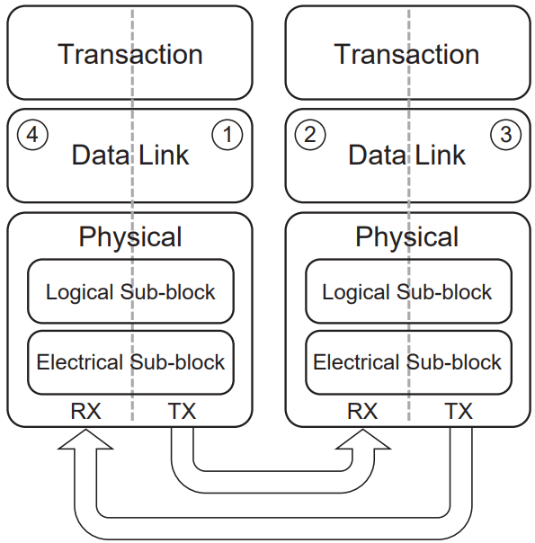
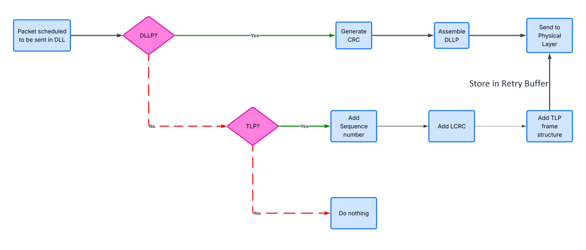
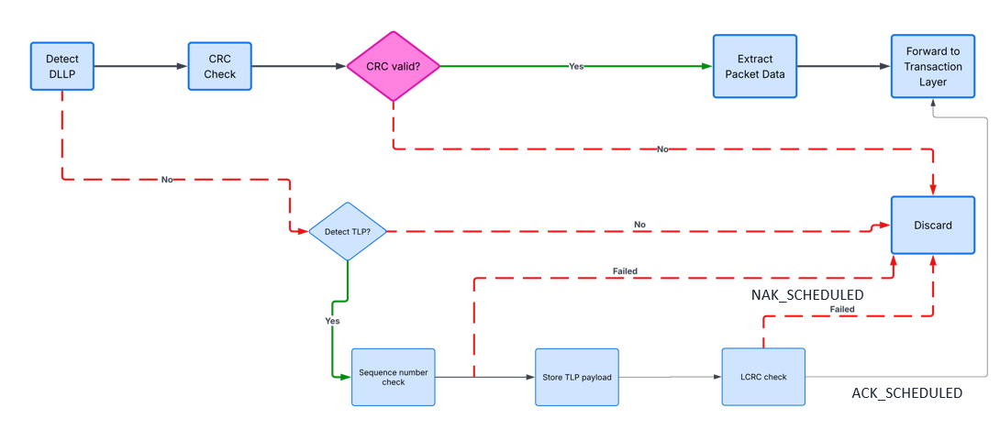
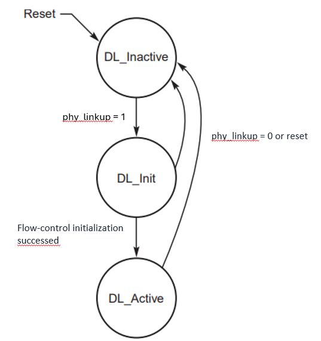
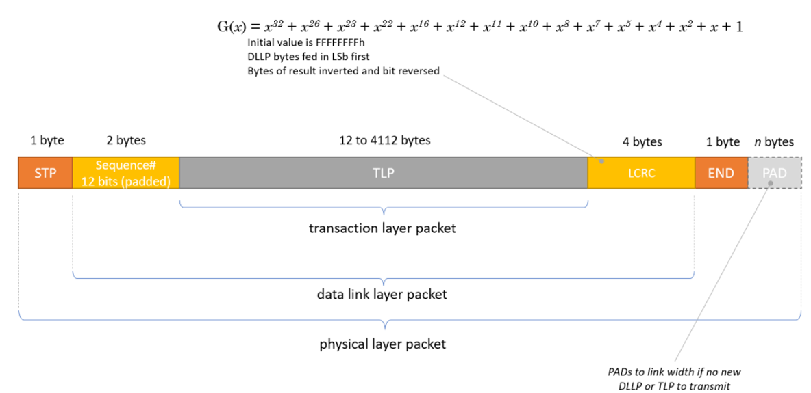
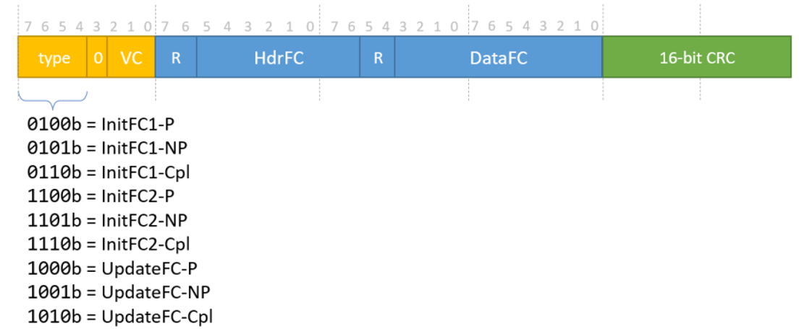
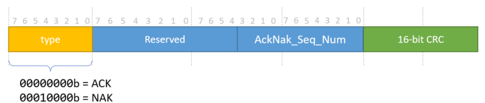

# PCIe Data Link Layer (DLL)

## Description
The **Data Link Layer (DLL)** sits between the **Transaction Layer (TL)** above and the **Physical Layer (MAC + PIPE + PCS)** below. Its job is to make the link *reliable*: it wraps every outgoing TLP with a sequence number and a 32-bit LCRC, holds transmitted TLPs in a retry buffer until they are acknowledged (the retry buffer currently has size of one), and drives the ACK/NAK protocol so corrupted or lost packets are replayed. On the DLLP side it generates and consumes Data Link Layer Packets — ACK/NAK and flow-control — and it runs the **flow-control initialization** handshake before the link is allowed to carry traffic.

In this design the DLL is soft-core RTL in the FPGA fabric. Below it, the logical Physical Layer (MAC) and the GateMate SerDes handle the LTSSM, 8b/10b and the serial link; the DLL reaches them through the PHY interface. The supported `DATA_WIDTH` is **32 or 64 bits**.

## Architecture
The DLL is split into a transmit datapath, a receive datapath, and the control logic that binds them together.

- **TX datapath**: takes TLP payload / DLLP fields from the TL, frames them (STP/SDP … END), appends the LCRC (TLP) or 16-bit CRC (DLLP), stores TLPs in the retry buffer, and streams the result to the PHY on `phy_tx_data`/`phy_tx_data_k`.

- **RX datapath**: shifts `phy_rx_data`/`phy_rx_data_k` into registers, detects STP/SDP, checks the CRC/LCRC, strips the framing, and forwards TLP payload / extracted DLLP fields to the TL.

- **TLP handler**: sequence-number assignment and checking, LCRC generation/validation, and the ACK/NAK scheduling logic (`NEXT_RCV_SEQ`, `NAK_SCHEDULED`, `AckNak_LATENCY_TIMER`).
- **DLLP handler**: builds and parses ACK/NAK and flow-control DLLPs; on ACK it retires TLPs from the retry buffer, on NAK it triggers a replay.
- **Retry buffer**: holds unacknowledged TLPs (currently has size of one) for replay, with a replay counter and replay timer.
- **DLL Init FSM**: gates the link through `DL_Inactive → DL_Init → DL_Active`, including flow-control initialization.

## The Interface
The DLL exposes an **upstream** interface to the Transaction Layer and a **downstream** interface to the Physical Layer.

### Upstream — Transaction Layer (TL)
| Direction | Signal              | Description                                  | Width      |
| --------- |:------------------- |:-------------------------------------------- |:---------- |
| in        | `tl_tx_data`        | TLP payload from TL                          | DATA_WIDTH |
| in        | `tl_tx_tlp_valid`   | Valid flag for the TLP payload               | 1 bit      |
| in        | `tl_tx_tlp_first`   | First batch of the payload from TL           | 1 bit      |
| in        | `tl_tx_tlp_last`    | Last batch of the payload from TL            | 1 bit      |
| in        | `tl_tx_hdr_credit`  | Header credits of DLLP from TL               | 8 bits     |
| in        | `tl_tx_data_credit` | Data credits of DLLP from TL                 | 12 bits    |
| in        | `tl_tx_update_type` | Update type of DLLP from TL                  | 2 bits     |
| in        | `tl_tx_packet_type` | Packet type of DLLP from TL                  | 2 bits     |
| in        | `tl_tx_dllp_valid`  | DLLP tx valid                                | 1 bit      |
| out       | `tl_rx_data`        | Extracted TLP payload forwarded to TL        | DATA_WIDTH |
| out       | `tl_rx_tlp_valid`   | Valid flag for the received TLP payload      | 1 bit      |
| out       | `tl_rx_tlp_first`   | First batch of the payload to TL             | 1 bit      |
| out       | `tl_rx_tlp_last`    | Last batch of the payload to TL              | 1 bit      |
| out       | `tl_rx_hdr_credit`  | Extracted header credits forwarded to TL     | 8 bits     |
| out       | `tl_rx_data_credit` | Extracted data credits forwarded to TL       | 12 bits    |
| out       | `tl_rx_update_type` | Extracted update type forwarded to TL        | 2 bits     |
| out       | `tl_rx_packet_type` | Extracted packet type forwarded to TL        | 2 bits     |
| out       | `tl_rx_dllp_valid`  | DLLP rx valid                                | 1 bit      |

### Downstream — Physical Layer
| Direction | Signal          | Description                                             | Width        |
| --------- |:--------------- |:------------------------------------------------------ |:------------ |
| in        | `phy_clk`       | PHY-domain clock                                       | 1 bit        |
| in        | `phy_reset`     | Async reset from the physical layer                    | 1 bit        |
| in        | `phy_linkup`    | Link-up indication from the PHY (LTSSM in **L0**)      | 1 bit        |
| in        | `phy_rx_data`   | Receive data stream from the physical layer            | DATA_WIDTH   |
| in        | `phy_rx_data_k` | K-character (control) markers for `phy_rx_data`        | DATA_WIDTH/8 |
| out       | `phy_tx_data`   | Transmit data stream to the physical layer             | DATA_WIDTH   |
| out       | `phy_tx_data_k` | K-character (control) markers for `phy_tx_data`        | DATA_WIDTH/8 |

> The PHY interface is the upstream side of the MAC layer — `phy_tx_data`/`phy_tx_data_k` map to the MAC's `i_TxData`/`i_TxDataK`, `phy_rx_data`/`phy_rx_data_k` to `o_RxData`/`o_RxDataK`, and `phy_linkup` to `o_LinkUp`. Currently supported `DATA_WIDTH` is 64 and 32 bits.

## DLL Init FSM
The DLL Init FSM tracks whether the link is usable. It is held in `DL_Inactive` out of reset and only reaches `DL_Active` once flow-control has been initialized.

| State         | Meaning / transition |
| ------------- |:-------------------- |
| `DL_Inactive` | Reset state; the DLL is idle. Move to `DL_Init` when `phy_linkup = 1`. |
| `DL_Init`     | Runs flow-control initialization. Contains two sub-states, `DL_FCINIT1 → DL_FCINIT2`. Move to `DL_Active` when flow-control initialization succeeds. |
| `DL_Active`   | Normal operation; TLPs and DLLPs flow. |

Any state returns to `DL_Inactive` on `phy_linkup = 0` or reset.

## Flow-control initialization
While in `DL_Init`, **all TLPs are blocked**. `DL_Init` has two sub-states:

- **`DL_FCINIT1`**
  - Transmit and receive three InitFC1 DLLPs: `InitFC1-P`, `InitFC1-NP`, `InitFC1-Cpl`.
  - Repeat the transmission every **34 µs** while the exit conditions are not met.
  - Record the FC unit values, then move on to `DL_FCINIT2`.
- **`DL_FCINIT2`**
  - Transmit and receive three InitFC2 DLLPs: `InitFC2-P`, `InitFC2-NP`, `InitFC2-Cpl`.
  - Repeat the transmission every **34 µs** while the exit conditions are not met.
  - Ignore the FC unit values, then move on to `DL_Active`.

## Packet Structures

### TLP

- Framing tokens: `STP = 1111_1011`, `END = 1111_1101`, `EDB = 1111_1110`.
- **LCRC**: `G(x) = x³² + x²⁶ + x²³ + x²² + x¹⁶ + x¹² + x¹¹ + x¹⁰ + x⁸ + x⁷ + x⁵ + x⁴ + x² + x + 1`, initial value `FFFF_FFFFh`, bytes fed in LSb first, result inverted and bit-reversed.

### DLLP

`DLLP Type = {packet_type[1:0], update_type[1:0], 1'b0, VC[2:0]}`. `HdrFC` is forwarded to the TL via `tl_tx_hdr_credit` and `DataFC` via `tl_tx_data_credit`; the `R` (reserved) bytes are not considered.

| Code (`byte 1`) | DLLP Type |
| --------------- |:--------- |
| `0000_0000`     | ACK |
| `0001_0000`     | NAK |
| `0010_0000`     | PM_Enter_L1 (currently not supported) |
| `0010_0001`     | PM_Enter_L23 (currently not supported) |
| `0010_0011`     | PM_Active_State_Request_L1 (currently not supported) |
| `0010_0100`     | PM_Request_Ack (currently not supported) |
| `0011_0000`     | Vendor specific (currently not supported) |
| `0100_0xxx`     | InitFC1-P  (`xxx` = virtual channel #) |
| `0101_0xxx`     | InitFC1-NP |
| `0110_0xxx`     | InitFC1-Cpl |
| `1100_0xxx`     | InitFC2-P |
| `1101_0xxx`     | InitFC2-NP |
| `1110_0xxx`     | InitFC2-Cpl |
| `1000_0xxx`     | UpdateFC-P |
| `1001_0xxx`     | UpdateFC-NP |
| `1010_0xxx`     | UpdateFC-Cpl |

- Framing tokens: `SDP = 0101_1100`, `END = 1111_1101`, `PAD = 1111_0111`.
- **CRC**: `G(x) = x¹⁶ + x¹² + x³ + x + 1`, initial value `FFFFh`, bytes fed in LSb first, result inverted and bit-reversed.
- PM and Vendor DLLPs are **not** supported in this first version of the DLL. Padding is not needed for the 32-bit and 64-bit datapaths.

### ACK/NAK
Field layout: `type | Reserved | AckNak_Seq_Num | 16-bit CRC`.

| `type`       | Meaning |
| ------------ |:------- |
| `0000_0000b` | ACK |
| `0001_0000b` | NAK |

## TLP Handler

### TX
- The TL indicates the start and end of the TLP payload.
- The DLL stores the TLP payload in RAM.
- Each TLP is assigned a **12-bit sequence number**.
- The TLP is protected by a **32-bit LCRC** (polynomial above); the result is complemented and the bits of each byte are stored in reversed order.
- **Transmission priority**: TLP/DLLP already in progress → NAK → ACK → FC DLLP → retry-buffer re-transmissions → new TLP from the TL → other DLLPs.

### RX
- The received TLP payload is stored in RAM, awaiting the integrity check.
- `NEXT_RCV_SEQ` holds the expected sequence number of the next TLP.
- `NAK_SCHEDULED` is asserted when a NAK is scheduled:
  - LCRC mismatch → the TLP is corrupt → `NAK_SCHEDULED` asserted.
  - If the TLP sequence number ≠ expected value:
    - `(NEXT_RCV_SEQ − TLP_Seq_Num) mod 4096 ≤ 2048` → the TLP is a duplicate → an ACK is scheduled.
    - Otherwise the TLP is out of sequence → `NAK_SCHEDULED` asserted.
- `AckNak_LATENCY_TIMER` counts the time since an ACK or NAK DLLP was scheduled for transmission.
- If the TLP sequence number **equals** the expected value, the control data is removed and the TLP is forwarded to the TL: the DLL marks the start and end of the TLP, `NEXT_RCV_SEQ` is incremented, `NAK_SCHEDULED` (if set) is cleared, and an ACK is scheduled.
- An ACK is sent when: in `DL_Active`, an ACK is scheduled, and `AckNak_LATENCY_TIMER` exceeds the Table 3-5 value; `NAK_SCHEDULED` is then cleared.
- Nullification of a TLP with `EDB` is **not** supported in this first version.

## DLLP Handler

### RX
- The DLL has a set of registers large enough to hold a DLLP; received data is shifted into them.
- On `SDP` detection, the DLLP is extracted from the registers with alignment.
- The DLLP data is extracted and its CRC is checked.
  - CRC fail → discard the packet.
  - CRC pass → forward the data to the TL with `tl_rx_dllp_valid` asserted.
- For ACK / NAK:
  - **ACK** → release all unacknowledged TLPs in the retry buffer (no more than two — the max retry-buffer size) at and below the sequence number in the ACK, and update `ACKD_SEQ` to `Ack_Seq_Num`.
  - **NAK** → retransmit all unacknowledged TLPs.

### TX
- The DLL receives `tl_tx_dllp_valid` from the TL to initiate a DLLP transmission.
- The data needed to form the DLLP is taken from the TL; the CRC is calculated and appended.
- On the TLP-integrity result: if the LCRC check of a received TLP fails, send a **NAK** with the erroneous packet's sequence number; if it passes, send an **ACK** with the error-free packet's sequence number.

## Retry Buffer
- A **2-bit replay number** counts how many times the retry buffer has been re-transmitted; on rollover from `11b` to `00b`, signal the Physical Layer to retrain the link.
- A **replay timer** counts the time since the last transmission or retransmission.
- The first version offers a retry buffer of **size one**; a later version may move to **size two**, implemented as a ping-pong scheme.

<!--## Prerequisites
The simulation can be run using the pcieVHost model … *TODO*

## Run Testbench
`make -f makefile.ica run`

## Testbench description
The testbench drives the DLL from both sides. On the **upstream** side it plays the Transaction Layer: it injects TLP payload (`tl_tx_*`) and requests DLLP transmissions (`tl_tx_dllp_valid`) to exercise framing, sequence-number assignment, LCRC generation and the transmission-priority logic. On the **downstream** side it models the PHY, feeding framed TLPs/DLLPs on `phy_rx_data`/`phy_rx_data_k` and driving `phy_linkup` so the DLL Init FSM walks through `DL_Inactive → DL_Init → DL_Active`, including flow-control initialization. Fault injection on the received stream (bad CRC/LCRC, out-of-sequence and duplicate sequence numbers) is used to check the ACK/NAK scheduling, the retry buffer and the replay/latency timers.-->

## References
- [PIPE Specs, Sept. 2025, v7.1](https://cdrdv2-public.intel.com/643108/643108_PIPE_Arch_Spec_Rev_7_1.pdf)
- [Simon Southwell's Primer](https://www.linkedin.com/pulse/pci-express-primer-1-overview-physical-layer-simon-southwell/)
- [DLL Overview](Doc/DLL_draft_v2.pdf)
- [openPCIE Controller White Paper](Doc/opensource-PCIE-Controller.applsci-16-03409.pdf)
- [openPCIE Controller repo](https://github.com/isomoye-msu/pcie_datalink_layer)
